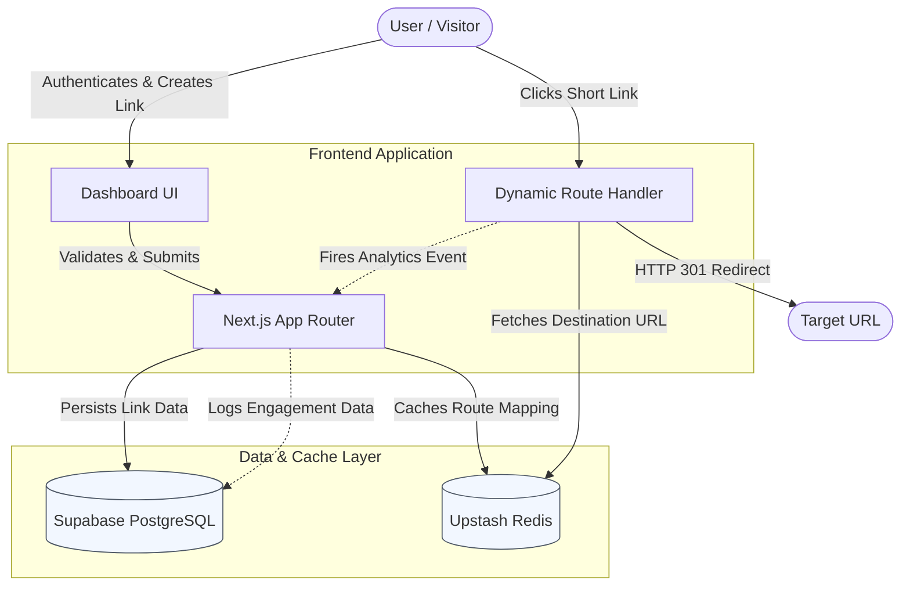

# Breve

Breve, a high-performance, self-hosted URL shortener equipped with comprehensive analytics and a modern user interface. Built for speed and reliability, Breve leverages edge caching and a robust database backend to deliver fast redirects and detailed click insights. 

## Architecture

Breve is built on a modern, serverless framework designed for scalability and low latency operations. Our stack choices prioritize developer experience and end-user performance.

*   **Frontend & API Layer**: Next.js 16 using the App Router.
*   **Database & Authentication**: Supabase (PostgreSQL). We rely heavily on Supabase for data persistence, Row Level Security (RLS) policies, and passwordless authentication.
*   **High-Speed Caching**: Upstash (Serverless Redis). This acts as our hot storage layer for extremely fast URL resolution at the edge.
*   **Styling & UI Components**: Tailwind CSS v4 paired with Base UI and Tabler Icons, providing a lightweight yet accessible interface.
*   **Tooling**: Biome handles all of our linting and formatting needs out of the box.

### How It Works

The system is separated into two primary workflows: link creation and link resolution. Both paths are strictly separated to prevent heavy analytics queries from slowing down the redirect mechanism.

1.  **Link Creation & Management**: When a user generates a new short link via the dashboard, the Next.js server actions validate the request and save the structured payload into the Supabase database. Simultaneously, the core routing information (the short slug mapping to the long URL) is pushed into Upstash Redis. This dual-write ensures data persistence while populating the cache layer.
2.  **Link Resolution & Analytics Tracking**: When a visitor accesses a Breve short link, the Next.js routing layer intercepts the request. The application swiftly retrieves the destination URL from Upstash Redis, bypassing the heavier PostgreSQL database. Concurrently, visitor metrics, including device type and geographical location mapped via client-side IP lookup, are captured. These metrics are asynchronously logged to Supabase, guaranteeing that tracking operations do not insert latency into the user's redirect path.

### System Diagram



## Features

*   **Blazing Fast Redirects**: By utilizing Upstash Redis as a key-value store, URL resolution happens in single-digit milliseconds.
*   **Comprehensive Analytics**: Track daily clicks, geographical locations, and device types through a responsive dashboard.
*   **Secure Authentication**: Passwordless login using Supabase Magic Links and One-Time Passwords (OTPs) reduces friction while maintaining security.
*   **Modern UI/UX**: A highly responsive dashboard crafted with Tailwind CSS v4 and Radix Base UI primitives, featuring custom color palettes.
*   **SEO Optimized**: Dynamic Open Graph and Twitter image generation ensures links look great when shared on social networks.

## Self-Hosting Guide

Deploying Breve on your own infrastructure is straightforward. Follow these steps to get your environment provisioned and running.

### Prerequisites

Before you begin, ensure you have the following installed and provisioned:

*   Node.js 20 or newer
*   The `pnpm` package manager
*   A Supabase account with a new project created
*   An Upstash account with an empty Redis database

### 1. Clone the Repository

Begin by grabbing the source code.

```bash
git clone https://github.com/Slogllykop/breve.git
cd breve
```

### 2. Install Dependencies

We use `pnpm` for fast and deterministic dependency resolution. Avoid using `npm` or `yarn` to prevent lockfile conflicts.

```bash
pnpm install
```

### 3. Environment Configuration

Copy the provided example environment template and populate it with your production credentials.

```bash
cp .env.example .env.local
```

Open `.env.local` in your editor and configure the following variables:

*   `UPSTASH_REDIS_REST_URL`: The REST endpoint provided in your Upstash database console.
*   `UPSTASH_REDIS_REST_TOKEN`: The secure access token for your Upstash database.
*   `NEXT_PUBLIC_SUPABASE_URL`: The unique URL for your Supabase project.
*   `NEXT_PUBLIC_SUPABASE_PUBLISHABLE_DEFAULT_KEY`: Your Supabase anonymous key (safe for client-side usage).

### 4. Database Setup

You must apply the database migrations to set up the necessary tables, relationships, and Row Level Security (RLS) policies in Supabase. The easiest method is via the Supabase CLI.

First, log in and link your local directory to your remote project:

```bash
npx supabase login
npx supabase link --project-ref your-project-ref
```

Push the database schema up to your project:

```bash
npx supabase db push
```

Alternatively, you can manually copy and execute the SQL syntax found in the `supabase/migrations/` directory directly into the Supabase SQL Editor within your browser dashboard.

### 5. Local Development

With the database and cache wired up, start the local development server:

```bash
pnpm dev
```

Navigate to `http://localhost:3000` in your browser. You can now register an account, authenticate, create links, and view your analytics dashboard.

### 6. Production Deployment

To compile the application for a production environment, typically deployed on platforms like Vercel or a standalone Node.js server:

```bash
pnpm build
pnpm start
```

For Vercel deployments, simply link your GitHub repository and populate the environment variables in the project settings. The Vercel build pipeline will automatically detect the Next.js framework and configure the rest.

## Maintenance and Code Quality

This project uses Biome. We chose Biome for its speed and consolidated toolchain.

*   To check for static analysis and linting errors, run: `pnpm lint`
*   To format your code automatically, run: `pnpm format`
